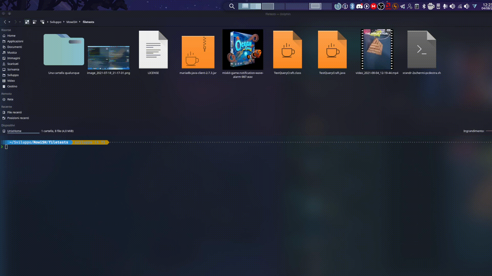

# MowiSH
`Version: 0.2.1`  

**M**ake **O**rder **WI**th ba**SH**   
With mowish, you can categorize your files by type in a folder. I.E. if you have a folder with images, audio and text file, executing mowish your directory will be reorganized into sub-folders each of which will contain only files of the same type.

## Documentation

Installation istruction, uninstallation and use can be found on documentation directory of this repo. 
The avaible languages are: 

- [ ITALIAN 🇮🇹](documentation/ITALIAN.md) 
- [ ENGLISH 🇬🇧](documentation/ENGLISH.md)

## license

Software is released under GPLv3 license 

## author 

- PsykeDady